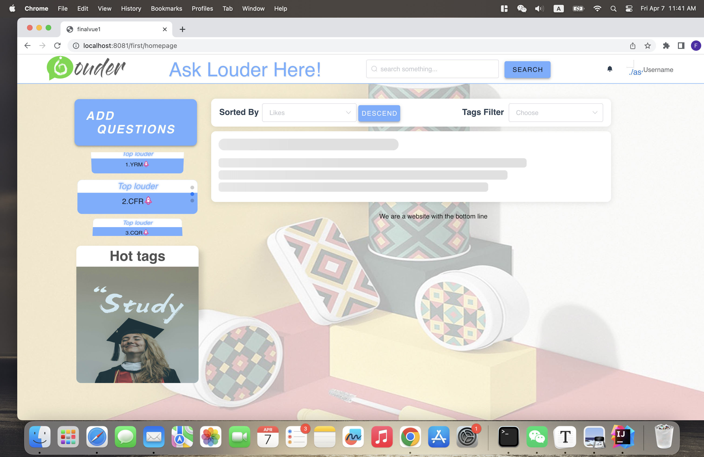

# Q-A-Web-Application-Front-End

### 1.Introduction

Software development project at Xi'an Jiaotong-Liverpool University.

Implemented the front-end portion of an online question and answer platform.

Tech Stack: Vue 3 + Vuex + Vue Router + Webpack + ElementUI

Original Project Repository: https://gitee.com/yngrxxm/finalvue1/tree/master/finalvue1

### 2.Download and Usage

- 1.Download the code

  ```shell
  git clone https://github.com/FENGRUI99/Q-A-Web-Front-End.git
  cd finalvue1
  ```

- 2.Download the code

  ```java
  npm install
  ```

  **For Macbook M1 Chip**Installing chromedriver may cause errors; you need to run `npm install chromedriver@87.0.1`

- Usage

  ```shell
  npm run dev
  ```

### 3. Implemented Page Functionalities

- Cover Page
- Login Page
  - Log In
- Registration Page
  - Register
- Main Page
  - Sort by Name, Posting Time, and Popularity
  - Filter by Type
  - Search Questions
  - Infinite Scroll with Skeleton Loading
  - Click on Ask Question Button
- User Profile Page
  - Edit Personal Information
  - Change Password
  - Post Questions and Answers
- Question Details Page
  - Display Question Details
  - Display Replies
  - Display Related Questions
- Chat Page
  - Select Friend to Chat

### 3. Interface Showcase



